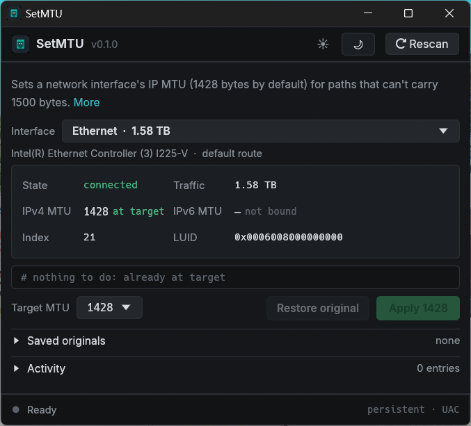

# SetMTU

A small Windows utility that sets a network interface's MTU (Maximum Transmission Unit) to a size
you choose, 1428 bytes by default, and puts the original back with one click.



## Why

The MTU is the largest packet an interface sends. Windows defaults to 1500 bytes, which is too large
for many PPPoE, fibre and VPN links. The symptoms are stalled page loads, slow transfers or dropped
calls, while everything else looks fine. Lowering the MTU (1428 is a common safe value) usually fixes it.

## Features

- Lists your network adapters and picks the busiest one, which is most likely your internet connection.
- MTU sizes from 1500 down to 1200, with the well-known ones labelled (PPPoE, WireGuard, IPv6 minimum).
- Shows the exact `netsh` commands before anything runs.
- Sets IPv4 and IPv6 together. Below 1280 (the IPv6 minimum) only IPv4 is changed.
- Changes are persistent and survive a restart.
- Saves each adapter's original values, so **Restore original** puts them back, even after closing the app.
- Light and dark themes.

## Download

Download the latest `SetMTU-v*-win-x64.zip` from the [Releases](https://github.com/riaanjutte/SetMTU/releases)
page, extract it and run `SetMTU.exe`. It's a single portable exe with no installer, and it runs on
Windows 10 and 11 (64-bit) without any extra runtimes. Each release lists SHA-256 checksums and
links to its VirusTotal scan results.

The exe isn't code-signed yet, so Windows may show a "Windows protected your PC" warning. Click
**More info**, then **Run anyway**.

## How it works

- Reading adapters and their MTUs uses the Windows IP Helper API and needs no special rights.
- Changing the MTU runs `netsh interface ipv4|ipv6 set subinterface <index> mtu=<size> store=persistent`
  through an elevated copy of the app, so Windows asks for administrator approval (UAC) once per change.
- Original values and your theme choice are stored in `%LOCALAPPDATA%\SetMTU\`.

## Building

Requires Windows and a Rust toolchain (MSVC).

```bash
cargo build --release
```

The exe is written to `target\release\setmtu.exe`.

To build a release zip and checksums in `dist\`:

```bash
powershell -ExecutionPolicy Bypass -File .\package.ps1
```

## Releasing

Releases are built by GitHub Actions. Bump `version` in `Cargo.toml`, commit, then push a matching tag:

```bash
git tag v0.1.1
git push origin v0.1.1
```

The [Release workflow](.github/workflows/release.yml) runs the tests, builds the zip with `package.ps1`
and publishes a GitHub release with SHA-256 checksums. Add the VirusTotal links to the release notes
afterwards.

## Licence

SetMTU is released under the [MIT licence](LICENSE).

It bundles the [Inter](https://rsms.me/inter/) typeface, which is licensed under the
[SIL Open Font License 1.1](assets/Inter-OFL.txt).
